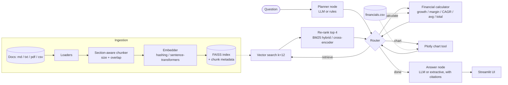

# Agentic Finance RAG

Ask questions about financial documents in plain English and get answers with **cited sources, exact calculations and charts**. A **LangGraph** planner reads each question and routes it through the tools it needs: **retrieval** over a local **FAISS** vector store with **re-ranking**, a deterministic **financial calculator**, and a **Plotly** chart tool. A **Streamlit** UI shows the answer, the agent's trace and the sources.

Numbers in answers come from tools, never from the LLM. Runs fully offline by default (hashing embeddings, BM25 hybrid re-ranking, rule-based planner), and switches to Groq, OpenAI or Gemini with one environment variable.

> The bundled dataset in `data/sample/` is **synthetic data about a fictional company ("Northwind Analytics Ltd.")**, written for this demo. It is not real financial information.

## Features

- **Ingestion** of `.md`, `.txt`, `.pdf` and `.csv`. Markdown is split by heading, tables are turned into sentences, and text is packed into overlapping chunks with section and document-title metadata
- **Embeddings**: offline signed feature hashing (default) or `sentence-transformers`
- **Vector store**: FAISS inner-product index over normalised vectors, persisted to disk
- **Re-ranking**: hybrid BM25 + dense score blend (default) or a cross-encoder
- **Planner agent (LangGraph)**: `planner → router → (retrieve | calculate | chart)* → answer`, with an LLM planner and a rule-based fallback
- **Calculator**: growth, margin, CAGR, average, total over the quarterly table, plus safe arithmetic (AST-whitelisted, no `eval`)
- **Charts**: Plotly line or bar charts of any table metrics
- **Streamlit UI** with file upload, re-indexing, trace, sources and calculations

## Architecture



The graph state carries the question, the remaining plan, retrieved contexts, calculation results, the chart and a trace. Each tool node writes its result and hands control back to the router until the plan is empty.

## Project layout

```
finrag/
  config.py       Settings from environment
  ingest.py       Loaders, section splitting, chunking, build_index()
  embeddings.py   HashingEmbedder, SentenceTransformerEmbedder
  vectorstore.py  FaissStore (add / search / save / load)
  rerank.py       BM25Reranker (hybrid), CrossEncoderReranker
  tools.py        calculate(), make_chart(), safe_eval()
  llm.py          OpenAI-compatible client for Groq / OpenAI / Gemini
  graph.py        LangGraph agent, rule-based planner, answer writers
  __main__.py     CLI
app.py            Streamlit UI
data/sample/      SYNTHETIC documents + quarterly table
tests/            pytest suite
```

## Setup

```bash
git clone https://github.com/Manohar8142/agentic-finance-rag.git
cd agentic-finance-rag
python -m venv .venv && source .venv/bin/activate   # Windows: .venv\Scripts\activate
pip install -r requirements.txt
cp .env.example .env     # optional
pytest
streamlit run app.py
```

The index is built automatically on first run into `.index/`. Rebuild with `python -m finrag --rebuild` or the **Rebuild index** button.

## Environment variables

| Variable | Default | Purpose |
|---|---|---|
| `LLM_PROVIDER` | `mock` | `mock`, `groq`, `openai` or `gemini` (planner + answer writer) |
| `LLM_API_KEY` | empty | Key for the chosen provider |
| `LLM_MODEL` | provider default | Model override |
| `EMBEDDINGS` | `hashing` | `hashing` or `sentence-transformers` |
| `EMBEDDING_MODEL` | `sentence-transformers/all-MiniLM-L6-v2` | Used when `EMBEDDINGS=sentence-transformers` |
| `RERANKER` | `bm25` | `bm25` or `cross-encoder` |
| `RERANKER_MODEL` | `cross-encoder/ms-marco-MiniLM-L-6-v2` | Used when `RERANKER=cross-encoder` |
| `CHUNK_SIZE` / `CHUNK_OVERLAP` | `700` / `120` | Chunking, in characters |
| `DATA_DIR` / `INDEX_DIR` / `FINANCIALS_CSV` | `data/sample` / `.index` / `data/sample/financials.csv` | Paths |

For `sentence-transformers` or `cross-encoder`, also `pip install sentence-transformers`.

## Usage

```bash
python -m finrag "How did revenue grow from Q1 FY2025 to Q2 FY2026, and what drove the margin improvement?"
python -m finrag "What are the main risks to operating margin?"
python -m finrag "Plot cloud and services revenue as a bar chart"      # writes chart.html
python -m finrag "What is the CAGR of cloud revenue from Q1 FY2025 to Q2 FY2026?"
```

In Python:

```python
from finrag.graph import load_agent
agent = load_agent()
result = agent.ask("How exposed is the company to foreign exchange?")
print(result["answer"]); print(result["trace"]); result.get("chart")
```

To use your own documents, point `DATA_DIR` at a folder (and `FINANCIALS_CSV` at a table with a `period` column), or upload files in the Streamlit sidebar.

## Example output

Offline mode (rule-based planner, extractive answer):

```
Q: How did revenue grow from Q1 FY2025 to Q2 FY2026, and what drove the margin improvement?

TRACE:
  planner: retrieve -> calculate
  retrieve: 4 chunks from ['annual_report_fy2025.md', 'q2_fy2026_earnings_call.md']
  calculate: {"op": "growth", "metric": "revenue", "start": "Q1 FY2025", "end": "Q2 FY2026"}
  calculate: {"op": "margin", "metric": "gross_profit", "start": "Q1 FY2025", "end": "Q2 FY2026"}
  answer

ANSWER:
Revenue went from 120.0 in Q1 FY2025 to 155.3 in Q2 FY2026 (USD m), a change of +35.3 (+29.4%).

Gross margin in Q2 FY2026 was 57.4% (89.2 / 155.3 USD m).

From the documents: CFO: Two things. Infrastructure costs per customer fell after we consolidated data centres, and services, which carry lower margins, were a smaller share of revenue. [q2_fy2026_earnings_call.md] ...
```

With an LLM configured, the planner emits the same JSON plan and the answer node writes a fluent, cited answer from the same contexts and calculation results.

## Tests

```bash
pytest -q
```

Covers chunking, FAISS save/load, calculator accuracy against the table, the arithmetic sandbox, planner routing and two end-to-end questions.

## Notes and limits

- The hashing embedder is lexical, not semantic. It keeps the demo offline and deterministic; use `sentence-transformers` for real corpora.
- The offline answer writer is extractive (it selects and cites sentences). The LLM writer is what you would use in practice.
- The calculator works on one quarterly table with a `period` column like `Q1 FY2025`.

## License

MIT, see [LICENSE](LICENSE).
